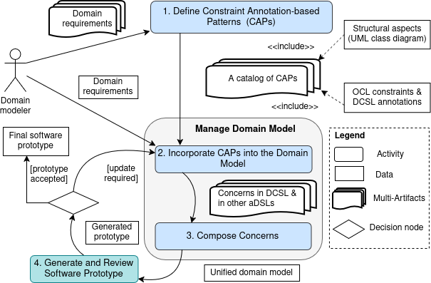
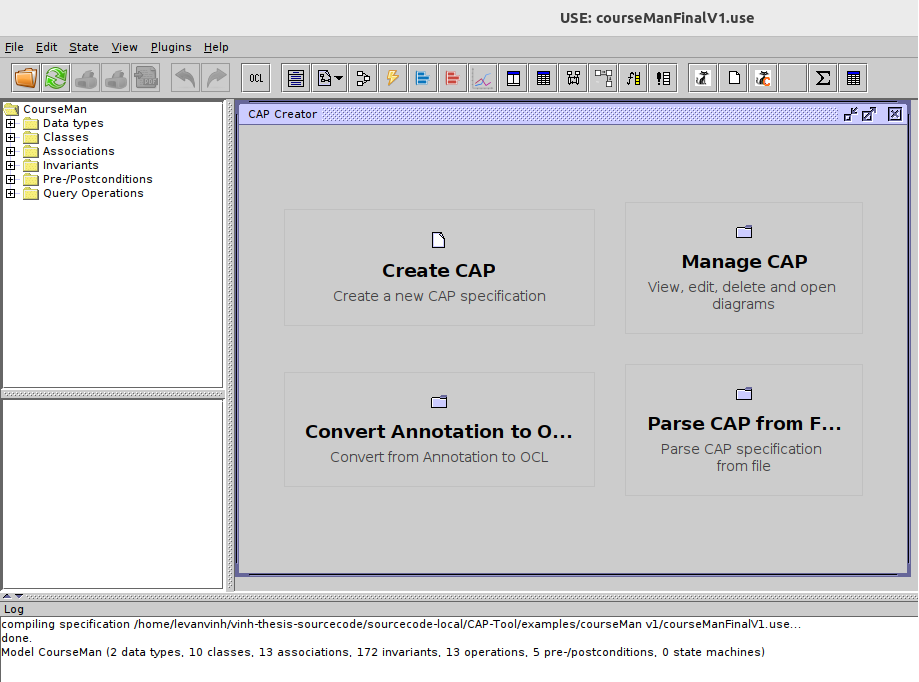
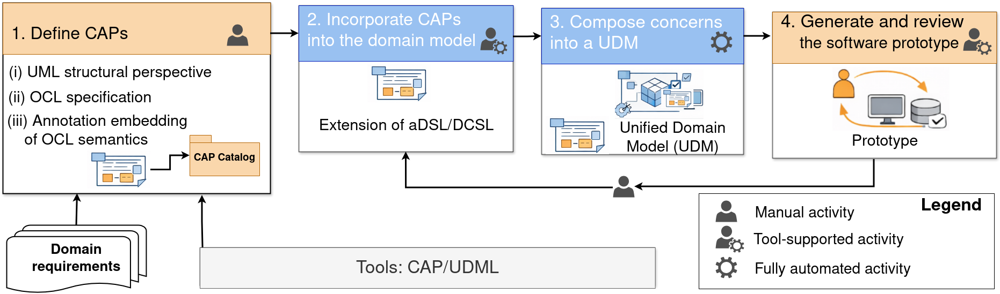

# CAP/DCSL Tool

**CAP/DCSL ** is a tool that supports the specification, integration, and
reconstruction of domain constraints within a Unified Domain Model
(UDM). It is implemented as an extension of the **UML-based
Specification Environment (USE)**, inheriting USE's capabilities for UML
structural modeling and OCL constraint validation while extending them
with **Constraint Annotation Pattern (CAP)** specifications and
automatic reconstruction of OCL invariants.

CAP/DCSL  enables domain constraints and behavioral concerns to be
integrated into a Unified Domain Model (UDM), providing the foundation
for subsequent model transformations and automatic software generation.

------------------------------------------------------------------------

# Overview

CAP/DCSL  provides the following capabilities:

-   Specify domain constraints using **Constraint Annotation Patterns
    (CAPs)**.
-   Attach CAP annotations directly to elements of a domain model.
-   Automatically reconstruct OCL invariants from CAP annotations.
-   Validate UML/OCL models using USE.
-   Integrate reconstructed constraints into a Unified Domain Model
    (UDM).
-   Serve as the input for model transformations such as **RM2UDM**,
    **UDM2AGL**, and automatic prototype generation.



------------------------------------------------------------------------

# Tool Architecture

The tool follows the processing pipeline below.

### UML Class Model

Represents the structural domain model, including classes, attributes,
associations, and multiplicities.

### CAP Annotation

Represents domain constraints as reusable annotation-based patterns with
well-defined semantics.

### OCL Invariant Reconstruction

Automatically reconstructs OCL invariants from CAP annotations.

### USE Validation

Validates the UML model together with the reconstructed OCL constraints.

### UDM Integration

Integrates structural models and reconstructed constraints into a
Unified Domain Model.

------------------------------------------------------------------------

# Screenshots

### CAP Pattern Management



### Applying CAPs in JDA



------------------------------------------------------------------------

# Usage

## Step 1. Prepare a UML/OCL Model

Create a domain model in USE consisting of:

``` text
Class
Attribute
Association
Multiplicity
OCL Constraint
```

Example:

``` text
model OrderMan

class Order
attributes
  id : Integer
  totalAmount : Real
end

class Payment
attributes
  amount : Real
end
```

## Step 2. Define a CAP

``` text
CAP: SumConstraint
Context: Order
Target: totalAmount
Expression:
  self.items->collect(i | i.price * i.quantity)->sum()
```

## Step 3. Apply CAP Annotations

``` java
@SumConstraint(
  context = Order,
  target = totalAmount,
  source = OrderItem,
  expression = "price * quantity"
)
```

## Step 4. Reconstruct OCL Invariants

``` ocl
context Order
inv TotalAmountConstraint:
  self.totalAmount =
    self.items->collect(i | i.price * i.quantity)->sum()
```

## Step 5. Validate Using USE

-   UML model syntax
-   OCL syntax
-   OCL invariant satisfaction
-   Object configurations

## Step 6. Integrate into the Unified Domain Model

``` text
DomainClass
DomainAttribute
DomainAssociation
DomainConstraint
CAPPattern
CAPApplication
```

# Example

``` ocl
context Payment
inv PaymentAmountPositive:
  self.amount > 0
```

``` java
@PositiveValue(
  context = Payment,
  attribute = amount
)
```

Automatically reconstructed into:

``` ocl
context Payment
inv PaymentAmountPositive:
  self.amount > 0
```

------------------------------------------------------------------------

# Key Features

  -----------------------------------------------------------------------
  Feature                        Description
  ------------------------------ ----------------------------------------
  CAP Pattern Management         Manage reusable CAP catalogs

  CAP Annotation                 Apply CAP annotations to domain models

  OCL Reconstruction             Automatically reconstruct OCL invariants

  USE Validation                 Validate UML/OCL models using USE

  UDM Integration                Integrate reconstructed constraints into
                                 the Unified Domain Model

  Code Generation Support        Provide input for automated prototype
                                 generation
  -----------------------------------------------------------------------

------------------------------------------------------------------------

# Notes

-   CAPs provide a higher-level abstraction for expressing recurring
    complex domain constraints without directly writing OCL.
-   The Unified Domain Model integrates structural models and
    reconstructed constraints into a single executable domain
    representation.
-   CAP/DCSL  supports model-driven transformation from requirement
    models to executable software following Domain-Driven Design
    principles.

